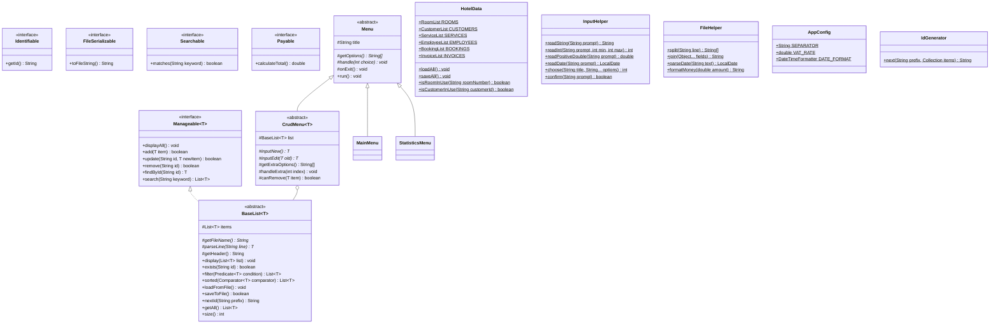
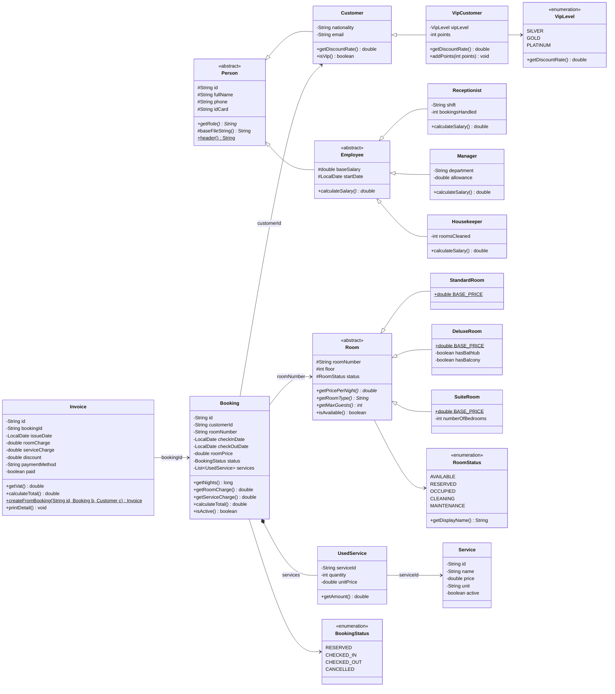
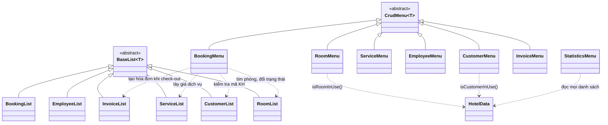

# Thiết kế hệ thống

Tài liệu này là **"hợp đồng" chung** của cả nhóm. Mỗi người làm một module riêng, nhưng các module gọi lẫn nhau
qua đúng những lớp, hàm, định dạng ghi ở đây. **Làm đúng tài liệu này thì ghép lại sẽ chạy được ngay.**

- Muốn đổi tên lớp, chữ ký hàm public, định dạng file: **báo cả nhóm trước**, trưởng nhóm sửa tài liệu này rồi mới code.
- Nếu issue ghi khác tài liệu này: **làm theo tài liệu này**.

> TV1 = Nguyễn Tấn Phát · TV2 = Nguyễn Duy Khang · TV3 = Phạm Phú Khang · TV4 = Bùi Khắc Cao Văn · TV5 = Đỗ Duy Anh

Mục lục:
1. [Sơ đồ lớp](#1-sơ-đồ-lớp)
2. [Danh sách lớp và người làm](#2-danh-sách-lớp-và-người-làm)
3. [Hợp đồng tích hợp: hàm public mỗi module phải có](#3-hợp-đồng-tích-hợp-hàm-public-mỗi-module-phải-có)
4. [Luồng nghiệp vụ giữa các module](#4-luồng-nghiệp-vụ-giữa-các-module)
5. [Định dạng file dữ liệu](#5-định-dạng-file-dữ-liệu)
6. [Mã và dữ liệu mẫu dùng chung](#6-mã-và-dữ-liệu-mẫu-dùng-chung)
7. [Thứ tự merge](#7-thứ-tự-merge)

---

## 1. Sơ đồ lớp

Ký hiệu: `+` public, `-` private, `#` protected, `*` hàm trừu tượng, `$` static (thuộc tính/hàm),
`<|--` kế thừa, `<|..` implement interface, `-->` tham chiếu (lưu mã), `*--` chứa.
Getter/setter thông thường không vẽ để sơ đồ gọn.

### 1.1. Khung chung (TV1, đã có sẵn trong `src/hotel/common`, `menu`, `util`)



### 1.2. Lớp đối tượng (model) và quan hệ giữa các module

Mọi lớp model (`Person`, `Room`, `Service`, `Booking`, `Invoice` và lớp con) đều implement
`Identifiable`, `FileSerializable`, `Searchable`; `Booking` và `Invoice` implement thêm `Payable`.
Mỗi lớp model có `-int createdCount$` và `+getCreatedCount()$ int` (không vẽ để gọn).



### 1.3. Lớp danh sách và menu



---

## 2. Danh sách lớp và người làm

| Package | Lớp | Loại | Người làm |
|---|---|---|---|
| `hotel` | `Main`, `HotelData` | class (static) | TV1 |
| `hotel.common` | `Identifiable`, `FileSerializable`, `Searchable`, `Payable`, `Manageable<T>` | interface | TV1 |
| `hotel.common` | `BaseList<T>` | abstract class | TV1 |
| `hotel.util` | `AppConfig`, `InputHelper`, `FileHelper`, `IdGenerator` | class (static) | TV1 |
| `hotel.menu` | `Menu`, `CrudMenu<T>` | abstract class | TV1 |
| `hotel.menu` | `MainMenu`, `StatisticsMenu` | class | TV1 |
| `hotel.model` | `Person` | abstract class | TV1 |
| `hotel.model` | `Room`, `StandardRoom`, `DeluxeRoom`, `SuiteRoom`, `RoomStatus` | abstract / class / enum | TV2 |
| `hotel.list` / `hotel.menu` | `RoomList`, `RoomMenu` | class | TV2 |
| `hotel.model` | `Customer`, `VipCustomer`, `VipLevel` | class / enum | TV3 |
| `hotel.model` | `Service` | class | TV3 |
| `hotel.list` / `hotel.menu` | `CustomerList`, `CustomerMenu`, `ServiceList`, `ServiceMenu` | class | TV3 |
| `hotel.model` | `Employee`, `Receptionist`, `Manager`, `Housekeeper` | abstract / class | TV4 |
| `hotel.list` / `hotel.menu` | `EmployeeList`, `EmployeeMenu` | class | TV4 |
| `hotel.model` | `Booking`, `BookingStatus`, `UsedService`, `Invoice` | class / enum | TV5 |
| `hotel.list` / `hotel.menu` | `BookingList`, `InvoiceList`, `BookingMenu`, `InvoiceMenu` | class | TV5 |

Tổng cộng khoảng 45 lớp / interface / enum.

---

## 3. Hợp đồng tích hợp: hàm public mỗi module phải có

Đây là phần quan trọng nhất để ghép module. Mỗi module **bắt buộc** có đúng các hàm public dưới đây
(đúng tên, kiểu tham số, kiểu trả về), vì module khác sẽ gọi chúng. Được thêm hàm khác tùy ý.

Mọi danh sách đã có sẵn từ `BaseList`: `findById`, `exists`, `search`, `filter`, `sorted`, `getAll`, `size`, `nextId`, `saveToFile`.

### 3.1. Phòng — TV2

```java
// hotel.model.RoomStatus  (enum)
AVAILABLE, RESERVED, OCCUPIED, CLEANING, MAINTENANCE
public String getDisplayName();            // "Trống", "Đã đặt", "Đang ở", "Đang dọn", "Bảo trì"

// hotel.model.Room  (abstract)
public String getId();                     // = số phòng, vd "101"
public String getRoomNumber();             // = getId()
public int getFloor();
public RoomStatus getStatus();
public void setStatus(RoomStatus status);
public boolean isAvailable();              // status == AVAILABLE
public abstract double getPricePerNight();
public abstract String getRoomType();      // "Standard", "Deluxe", "Suite"
public abstract int getMaxGuests();

// hotel.list.RoomList extends BaseList<Room>
public List<Room> findByStatus(RoomStatus status);
public List<Room> findByType(String roomType);
public List<Room> findByPriceRange(double min, double max);
public List<Room> getAvailableRooms();
```

**Dùng bởi:** TV5 (đặt phòng, check-in, check-out đổi trạng thái phòng), TV1 (thống kê).

### 3.2. Khách hàng — TV3

```java
// hotel.model.VipLevel  (enum)
SILVER, GOLD, PLATINUM
public double getDiscountRate();           // 0.05, 0.10, 0.15

// hotel.model.Customer extends Person
public String getNationality();
public String getEmail();
public double getDiscountRate();           // Customer: 0.0 — VipCustomer override
public boolean isVip();                    // Customer: false — VipCustomer override: true

// hotel.model.VipCustomer extends Customer
public VipLevel getVipLevel();
public int getPoints();
public void addPoints(int points);

// hotel.list.CustomerList extends BaseList<Customer>
public Customer findByPhone(String phone);    // null nếu không có
public Customer findByIdCard(String idCard);  // null nếu không có
public List<Customer> getVipCustomers();
```

**Dùng bởi:** TV5 (kiểm tra mã KH khi đặt phòng, `getDiscountRate()` khi lập hóa đơn), TV1 (thống kê top khách).

### 3.3. Dịch vụ — TV3

```java
// hotel.model.Service
public String getId();
public String getName();
public double getPrice();
public String getUnit();
public boolean isActive();

// hotel.list.ServiceList extends BaseList<Service>
public List<Service> getActiveServices();
```

**Dùng bởi:** TV5 (khách gọi dịch vụ: chọn từ `getActiveServices()`, lấy `getPrice()` lưu vào `UsedService`), TV1.

### 3.4. Nhân viên — TV4

```java
// hotel.model.Employee extends Person  (abstract)
public double getBaseSalary();
public LocalDate getStartDate();
public abstract double calculateSalary();

// hotel.list.EmployeeList extends BaseList<Employee>
public List<Employee> findByRole(String role);
public double getTotalSalary();            // tổng calculateSalary() của mọi nhân viên
```

**Dùng bởi:** TV1 (thống kê quỹ lương). Nhân viên không liên kết với module khác.

### 3.5. Đặt phòng — TV5

```java
// hotel.model.BookingStatus  (enum)
RESERVED, CHECKED_IN, CHECKED_OUT, CANCELLED

// hotel.model.UsedService
public UsedService(String serviceId, int quantity, double unitPrice);
public String getServiceId();
public int getQuantity();
public double getUnitPrice();
public double getAmount();                 // quantity * unitPrice

// hotel.model.Booking
public String getCustomerId();
public String getRoomNumber();
public LocalDate getCheckInDate();
public LocalDate getCheckOutDate();
public double getRoomPrice();              // giá 1 đêm TẠI LÚC ĐẶT
public BookingStatus getStatus();
public List<UsedService> getServices();
public long getNights();                   // số đêm, tối thiểu 1
public double getRoomCharge();             // getNights() * getRoomPrice()
public double getServiceCharge();          // tổng getAmount()
public double calculateTotal();            // getRoomCharge() + getServiceCharge()
public boolean isActive();                 // RESERVED hoặc CHECKED_IN

// hotel.list.BookingList extends BaseList<Booking>
public List<Booking> findByCustomer(String customerId);
public List<Booking> findByRoom(String roomNumber);
public List<Booking> findByStatus(BookingStatus status);
public boolean isRoomAvailable(String roomNumber, LocalDate from, LocalDate to); // không trùng lịch booking đang active
public boolean hasActiveBookingForRoom(String roomNumber);
public boolean hasActiveBookingForCustomer(String customerId);
```

**Vì sao `Booking` lưu `roomPrice` và `UsedService` lưu `unitPrice`?** Để khi TV2 sửa giá phòng hoặc TV3 sửa giá / xóa dịch vụ
thì các booking cũ **không bị đổi tiền** và không bị lỗi. Module Đặt phòng chỉ cần đọc giá **một lần lúc đặt / lúc gọi dịch vụ**.

### 3.6. Hóa đơn — TV5

```java
// hotel.model.Invoice
public static Invoice createFromBooking(String id, Booking booking, Customer customer);
//   roomCharge    = booking.getRoomCharge()
//   serviceCharge = booking.getServiceCharge()
//   discount      = (roomCharge + serviceCharge) * customer.getDiscountRate()   <- đa hình Customer / VipCustomer
public String getBookingId();
public LocalDate getIssueDate();
public double getRoomCharge();
public double getServiceCharge();
public double getDiscount();
public double getVat();                    // (roomCharge + serviceCharge - discount) * AppConfig.VAT_RATE
public double calculateTotal();            // roomCharge + serviceCharge - discount + getVat()
public boolean isPaid();

// hotel.list.InvoiceList extends BaseList<Invoice>
public Invoice findByBooking(String bookingId);              // null nếu chưa có
public List<Invoice> findByDateRange(LocalDate from, LocalDate to);
public double getRevenue(LocalDate from, LocalDate to);      // tổng calculateTotal() của hóa đơn đã thanh toán
```

**Dùng bởi:** TV1 (thống kê doanh thu).

### 3.7. `HotelData` — điểm nối giữa các module (TV1)

```java
public static final RoomList ROOMS;          // TV2 bỏ comment khi xong #2
public static final CustomerList CUSTOMERS;  // TV3 bỏ comment khi xong #3
public static final ServiceList SERVICES;    // TV3 bỏ comment khi xong #4
public static final EmployeeList EMPLOYEES;  // TV4 bỏ comment khi xong #5
public static final BookingList BOOKINGS;    // TV5 bỏ comment khi xong #6
public static final InvoiceList INVOICES;    // TV5 bỏ comment khi xong #7

// Đã có sẵn, luôn trả về false. TV5 sửa thân hàm khi xong #6 (xem TODO trong code).
public static boolean isRoomInUse(String roomNumber);
public static boolean isCustomerInUse(String customerId);
```

**Tránh phụ thuộc vòng:** TV2 và TV3 cần chặn xóa phòng / khách đang có booking, nhưng không thể gọi `BookingList`
(vì TV5 chưa làm xong). Vì vậy:

- `RoomMenu.canRemove()` gọi `HotelData.isRoomInUse(room.getId())`
- `CustomerMenu.canRemove()` gọi `HotelData.isCustomerInUse(customer.getId())`

Hai hàm này đã có sẵn nên code của TV2, TV3 **biên dịch được ngay**. Khi TV5 xong `BookingList`, TV5 chỉ sửa thân hai hàm này
(`return BOOKINGS.hasActiveBookingForRoom(roomNumber);`) là việc chặn xóa tự hoạt động, TV2 và TV3 không phải sửa gì.

---

## 4. Luồng nghiệp vụ giữa các module

### 4.1. Trạng thái phòng và booking

| Thao tác (trong `BookingMenu`, TV5) | Điều kiện | Booking | Phòng |
|---|---|---|---|
| Đặt phòng | Mã KH tồn tại; ngày trả > ngày nhận; phòng `isAvailable()` và `BOOKINGS.isRoomAvailable(...)` | tạo mới, `RESERVED`, lưu `roomPrice = room.getPricePerNight()` | `AVAILABLE` → `RESERVED` |
| Check-in | booking đang `RESERVED` | → `CHECKED_IN` | → `OCCUPIED` |
| Thêm dịch vụ | booking đang `CHECKED_IN`; dịch vụ `isActive()` | thêm `UsedService(id, sl, service.getPrice())` | — |
| Check-out | booking đang `CHECKED_IN` | → `CHECKED_OUT`; tạo `Invoice.createFromBooking(...)` thêm vào `INVOICES` | → `CLEANING` |
| Hủy (chức năng Xóa) | booking đang `RESERVED` | → `CANCELLED` (không xóa khỏi file) | → `AVAILABLE` |

| Thao tác (trong `RoomMenu`, TV2) | Phòng |
|---|---|
| Dọn xong | `CLEANING` → `AVAILABLE` |
| Bảo trì / hết bảo trì | `AVAILABLE` ↔ `MAINTENANCE` |

### 4.2. Quy tắc khi module này sửa dữ liệu của module khác

- Chỉ sửa qua hàm public (`room.setStatus(...)`, `HotelData.INVOICES.add(...)`), **không** sửa file `.txt` của module khác trực tiếp.
- Sửa xong phải lưu danh sách đó: ví dụ check-in xong gọi `HotelData.ROOMS.saveToFile()` và `list.saveToFile()`.
- Lấy dữ liệu module khác luôn qua `HotelData.XXX` (không `new RoomList()` lần nữa, vì sẽ thành 2 danh sách khác nhau).

### 4.3. Thứ tự đọc file khi khởi động

`HotelData.loadAll()` đọc theo thứ tự: `ROOMS`, `CUSTOMERS`, `SERVICES`, `EMPLOYEES`, `BOOKINGS`, `INVOICES`.
Module sau có thể tra cứu module trước. Khi thoát, `saveAll()` ghi lại tất cả.

---

## 5. Định dạng file dữ liệu

- Mã hóa **UTF-8**, mỗi dòng 1 đối tượng, các trường phân cách bằng `|`. Dòng bắt đầu bằng `#` là chú thích.
- Tách dòng bằng `FileHelper.split(line)`, ghép dòng bằng `FileHelper.join(...)`.
- Ngày dạng `dd/MM/yyyy`. Số tiền là số thực, không có dấu phẩy ngăn cách. `boolean` ghi `true` / `false`. Enum ghi tên hằng (`AVAILABLE`).
- Lớp có nhiều loại con thì **trường đầu tiên là loại** để `parseLine()` biết tạo lớp con nào.

### `rooms.txt` (TV2)

```
STANDARD|soPhong|tang|trangThai
DELUXE|soPhong|tang|trangThai|coBonTam|coBanCong
SUITE|soPhong|tang|trangThai|soPhongNgu
```
```
STANDARD|101|1|AVAILABLE
DELUXE|201|2|OCCUPIED|true|false
SUITE|301|3|AVAILABLE|2
```

### `customers.txt` (TV3)

```
NORMAL|maKH|hoTen|sdt|cccd|quocTich|email
VIP|maKH|hoTen|sdt|cccd|quocTich|email|hangVip|diem
```
```
NORMAL|KH001|Nguyễn Văn An|0901234567|079201001234|Việt Nam|an@gmail.com
VIP|KH002|Trần Thị Bình|0912345678|079301005678|Việt Nam|binh@gmail.com|GOLD|120
```

### `services.txt` (TV3)

```
maDV|tenDV|donGia|donVi|dangHoatDong
```
```
DV001|Ăn sáng buffet|150000.0|suất|true
```

### `employees.txt` (TV4)

```
RECEPTIONIST|maNV|hoTen|sdt|cccd|luongCoBan|ngayVaoLam|ca|soBookingXuLy
MANAGER|maNV|hoTen|sdt|cccd|luongCoBan|ngayVaoLam|phongBan|phuCap
HOUSEKEEPER|maNV|hoTen|sdt|cccd|luongCoBan|ngayVaoLam|soPhongDaDon
```
```
RECEPTIONIST|NV001|Lê Văn Cường|0987654321|079200009999|7000000.0|01/03/2024|Đêm|35
MANAGER|NV002|Phạm Thị Dung|0976543210|079199008888|15000000.0|15/01/2022|Lễ tân|3000000.0
HOUSEKEEPER|NV003|Võ Văn Em|0965432109|079198007777|6000000.0|10/06/2023|120
```

### `bookings.txt` (TV5)

```
maDP|maKH|soPhong|ngayNhan|ngayTra|giaPhong|trangThai|dichVu
```
Trường `dichVu` là danh sách `maDV:soLuong:donGia` cách nhau bằng dấu phẩy, **để trống** nếu chưa dùng dịch vụ.
```
DP001|KH001|101|01/10/2026|03/10/2026|500000.0|CHECKED_OUT|DV001:2:150000.0,DV003:1:500000.0
DP002|KH002|201|05/10/2026|08/10/2026|1000000.0|CHECKED_IN|
```

### `invoices.txt` (TV5)

```
maHD|maDP|ngayLap|tienPhong|tienDichVu|giamGia|phuongThucTT|daThanhToan
```
VAT và tổng tiền **không lưu**, luôn tính lại bằng `getVat()` / `calculateTotal()`. Phương thức thanh toán: `CASH`, `CARD`, `TRANSFER`.
```
HD001|DP001|03/10/2026|1000000.0|800000.0|0.0|CASH|true
```

---

## 6. Mã và dữ liệu mẫu dùng chung

Mã tự sinh bằng `list.nextId(PREFIX)`:

| Đối tượng | Tiền tố | Ví dụ |
|---|---|---|
| Khách hàng | `KH` | KH001 |
| Nhân viên | `NV` | NV001 |
| Dịch vụ | `DV` | DV001 |
| Đặt phòng | `DP` | DP001 |
| Hóa đơn | `HD` | HD001 |
| Phòng | số phòng (nhập tay) | 101, 202 |

**Dữ liệu mẫu tối thiểu** (để `bookings.txt` và `invoices.txt` của TV5 tham chiếu được, ai làm module nào thì tạo đủ phần đó):

| File | Phải có ít nhất | Người tạo |
|---|---|---|
| `rooms.txt` | Phòng `101`–`105` (Standard, tầng 1), `201`–`204` (Deluxe, tầng 2), `301`–`302` (Suite, tầng 3) | TV2 |
| `customers.txt` | `KH001`–`KH010`, trong đó `KH002`, `KH005`, `KH008` là VIP | TV3 |
| `services.txt` | `DV001` Ăn sáng, `DV002` Giặt ủi, `DV003` Spa, `DV004` Đưa đón sân bay, `DV005` Minibar, `DV006` Thuê xe máy | TV3 |
| `employees.txt` | `NV001`–`NV008`, đủ 3 loại | TV4 |
| `bookings.txt` | ≥ 8 booking đủ 4 trạng thái, chỉ dùng mã phòng / KH / DV ở trên | TV5 |
| `invoices.txt` | 1 hóa đơn cho mỗi booking `CHECKED_OUT` | TV5 |

Trạng thái phòng trong `rooms.txt` phải **khớp** với `bookings.txt`: phòng có booking `CHECKED_IN` thì là `OCCUPIED`,
có booking `RESERVED` thì là `RESERVED`. TV5 kiểm tra và báo TV2 sửa nếu lệch. TV1 rà lại lần cuối ở issue #8.

---

## 7. Thứ tự merge

```
#1 Khung chung (đã xong)
 ├── #2 Phòng ─────────┐
 ├── #3 Khách hàng ────┤
 ├── #4 Dịch vụ ───────┼──> #6 Đặt phòng ──> #7 Hóa đơn ──> #8 Thống kê + tích hợp
 └── #5 Nhân viên ─────┴─────────────────────────────────────┘
```

- #2, #3, #4, #5 làm và merge **song song**, không phụ thuộc nhau.
- TV5 viết trước `Booking`, `UsedService`, `Invoice`, `BookingList`, `InvoiceList` (chỉ cần khung chung). `BookingMenu` cần #2, #3, #4 đã merge.
- Mỗi PR phải **biên dịch được trên `main` mới nhất** (`git pull origin main` trước khi tạo PR) và CI xanh.
